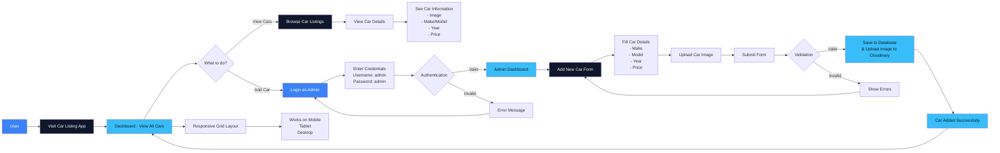

# User Flow Diagram

```mermaid
graph LR
    A[User] --> B[Visit Car Listing App]
    B --> C[Dashboard - View All Cars]
    
    C --> D{What to do?}
    D -->|View Cars| E[Browse Car Listings]
    D -->|Add Car| F[Login as Admin]
    
    F --> G[Enter Credentials<br/>Username: admin<br/>Password: admin]
    G --> H{Authentication}
    H -->|Valid| I[Admin Dashboard]
    H -->|Invalid| J[Error Message]
    J --> F
    
    I --> K[Add New Car Form]
    K --> L[Fill Car Details<br/>- Make<br/>- Model<br/>- Year<br/>- Price]
    L --> M[Upload Car Image]
    M --> N[Submit Form]
    N --> O{Validation}
    O -->|Valid| P[Save to Database<br/>& Upload Image to Cloudinary]
    O -->|Invalid| Q[Show Errors]
    Q --> K
    
    P --> R[Car Added Successfully]
    R --> C
    
    E --> S[View Car Details]
    S --> T[See Car Information<br/>- Image<br/>- Make/Model<br/>- Year<br/>- Price]
    
    C --> U[Responsive Grid Layout]
    U --> V[Works on Mobile<br/>Tablet<br/>Desktop]
    
    style A fill:#3b82f6,color:white
    style B fill:#0f172a,color:#f8fafc
    style C fill:#38bdf8,color:#0f172a
    style E fill:#0f172a,color:#f8fafc
    style F fill:#3b82f6,color:white
    style I fill:#38bdf8,color:#0f172a
    style K fill:#0f172a,color:#f8fafc
    style P fill:#38bdf8,color:#0f172a
    style R fill:#38bdf8,color:#0f172a
```